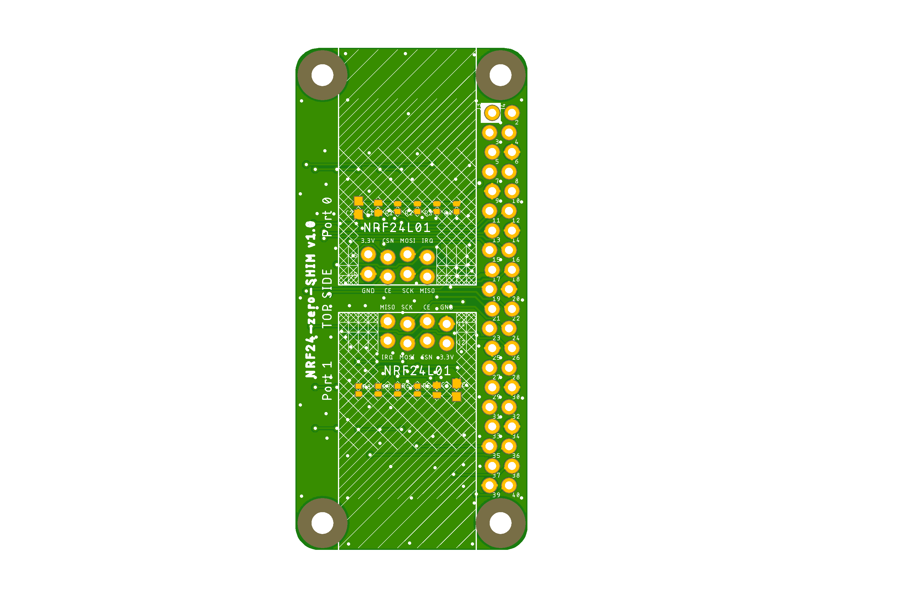

# NRF24-SHIM project

My NRF24-SHIM (mini-HAT) for Raspberry Pi.

This project came to reality when I was looking for a way to connect standard NRF24L01+ module to my Pi.
I had found many tutorials explaining how to connect NRF24 modules to Pi but no ready made board or even proper schematics.
"Hmm... DIY!" I've told myself and here we are.

Some useful links:

- [pinout.xyz](https://pinout.xyz/) - a brilliant resource on topic of Pi's pinout and HATs.
- [Communication between Arduino AND Raspberry Pi using NRF24L01](https://medium.com/@anujdev11/communication-between-arduino-and-raspberry-pi-using-nrf24l01-818687f7f363) - how to setup NRF24L01 with Pi.
- [Funkkommunikation zwischen Raspberry Pi’s und Arduinos (2.4 GHz)](https://tutorials-raspberrypi.de/funkkommunikation-zwischen-raspberry-pis-und-arduinos-2-4-ghz/) - how to setup NRF24L01 with Pi in German.
- [Connecting an nRF24L01+ to Raspberry Pi](https://www.hackster.io/wirekraken/connecting-an-nrf24l01-to-raspberry-pi-9c0a57) - one more setup example.

## NRF24-SHIM

Raspberry Pi 40-pin **NRF24-SHIM** mini-HAT.

Preview:

[Schematics in PDF format](NRF24-SHIM.pdf)

Features:

- locked Pi headers
- locked NRF24 headers
- double set of Pi headers (for inside and outside mount)
- SPI0/SPI1 bus selection
- CE/IRQ selection
- can be used as SHIM (no headers) or HAT (with headers)

Pins Configuration:

|NRF24 Pin |Option 1 |Option 2 |
|----------|---------|---------|
|CE        |GPIO22\* |GPIO25   |
|CSN       |GPIO8\*  |GPIO18   |
|SCK       |GPIO11\* |GPIO21   |
|MOSI      |GPIO10\* |GPIO20   |
|MISO      |GPIO9\*  |GPIO19   |
|IRQ       |GPIO23   |GPIO24   |

\*) the pin is connected by default.

CAM files are available.

## NRF24-mini-SHIM

Raspberry Pi **NTF32-mini-SHIM** micro-HAT.

Preview:

[Schematics in PDF format](NRF24-mini-SHIM.pdf)

Features:

- locked Pi headers
- locked NRF24 headers
- CE/IRQ selection
- very small size
- fits on 26- and 40-pin Pi headers

Pins Configuration:

|NRF24 Pin |Option 1 |Option 2 |
|----------|---------|---------|
|CE        |GPIO22\* |GPIO25   |
|CSN       |GPIO8\*  |         |
|SCK       |GPIO11\* |         |
|MOSI      |GPIO10\* |         |
|MISO      |GPIO9\*  |         |
|IRQ       |GPIO23   |GPIO24   |

\*) the pin is connected by default.

CAM files are available.

## NRF24-zero-SHIM

Raspberry Pi zero 40-pin **NRF24-zero-SHIM** mini-HAT.

Preview:

[Schematics in PDF format](NRF24-zero-SHIM.pdf)

Features:

- locked Pi headers
- locked NRF24 headers
- Pi zero board style
- SPI0/SPI1 bus selection
- CE/IRQ selection
- double NRF24 configuration possible
- can be used as SHIM (no headers) or HAT (with headers)

Pins Configuration:

|NRF24 Pin |Option 1 |Option 2 |Option 3 |Option 4 |Option 5 |
|----------|---------|---------|---------|---------|---------|
|P0 CE     |GPIO22\* |GPIO25   |GPIO27   |         |         |
|P0 CSN    |GPIO8\*  |GPIO7    |GPIO18   |GPIO17   |GPIO16   |
|P0 SCK    |GPIO11\* |GPIO21   |         |         |         |
|P0 MOSI   |GPIO10\* |GPIO20   |         |         |         |
|P0 MISO   |GPIO9\*  |GPIO19   |         |         |         |
|P0 IRQ    |GPIO23   |GPIO24   |         |         |         |
|P1 CE     |GPIO22   |GPIO25\* |GPIO27   |         |         |
|P1 CSN    |GPIO8    |GPIO7    |GPIO18\* |GPIO17   |GPIO16   |
|P1 SCK    |GPIO11   |GPIO21\* |         |         |         |
|P1 MOSI   |GPIO10   |GPIO20\* |         |         |         |
|P1 MISO   |GPIO9    |GPIO19\* |         |         |         |
|P1 IRQ    |GPIO23   |GPIO24   |         |         |         |

\*) the pin is connected by default.

CAM files are available.

## BOM

Bill Of Materials is currently available only for LCSC Electronic Components Distributor, which is probably cheapest anyway.

### LCSC BOM

|Designator                     |Part/Value |Package/Footprint |LCSC # |
|-------------------------------|-----------|------------------|-------|
|C1, C3                         |Cap. 100nF |0402              |C1525  |
|C2, C4                         |Cap. 1uF   |0603              |C15849 |
|R1, R2, R3, R4, R5, R6, R7, R8 |Res. 10K   |0402              |C25744 |

## How to help

Your contributions as code, resources or finances are welcome!
Please contact me directly over e-mail andriy.golovnya@gmail.com or over [GitHub profile](https://github.com/red-scorp).
Link for [Paypal donations](http://paypal.me/redscorp), which are always welcome.
Thanks in advance!
